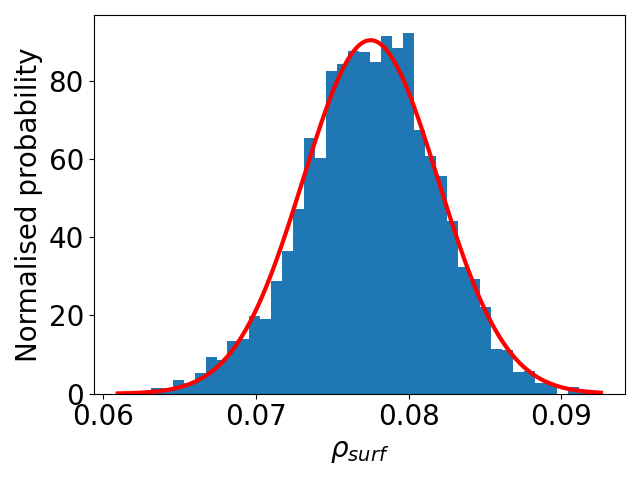
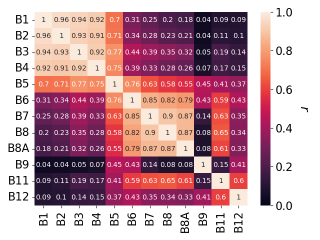

# S2-L2A-RUT
The software generates radiometric uncertainty estimates and spectral error correlation
for the Copernicus Sentinel-2 L2A products (i.e. surface reflectance) and L1C products (i.e. TOA reflectance).

## Get the code
You will need to have installed a [Git client](https://git-scm.com) for fetching the source code

Clone or fork the repository at [GitHub](https://github.com/senbox-org/snap-rut)
```
> git clone https://github.com/gorronyo/S2-L2A-RUT.git
> cd snap-rut
```
You can update your checked-out sources from the remote repository by running 
```
> git pull --rebase
```

## Requirements
The code uses *common* libraries from Python. You will need to have installed those listed in the *requirements.tx*.
You can directly installed them as follows:
```
> pip install -r requirements.txt
```

You will also need to install two separate software programmes:
- [SNAP](https://step.esa.int/main/download/snap-download/) and configure the [Python snappy wrapper](https://senbox.atlassian.net/wiki/spaces/SNAP/pages/50855941/Configure+Python+to+use+the+SNAP-Python+snappy+interface) during (or after) the installation. Recommended SNAP latest version 9.0.0.
- [Libradtran](http://www.libradtran.org/doku.php). Recommended latest version 2.0.4.

The code has been tested with Python 3.6. Higher versions of Python might not work correctly with the Python snappy wrapper (see [here](https://senbox.atlassian.net/wiki/spaces/SNAP/pages/50855941/Configure+Python+to+use+the+SNAP-Python+snappy+interface)).

## Running the code
The code includes a script *run_L2a_unc.py* that wraps the processing workflow and runs several examples.
The lines 6-23 in this script are the only ones of interest to the user:

```python class:"lineNo"
6   samples = 1000
7   librad_bin = None # path to folder with libradtran binary. E.g. '/home/gorrono/libRadtran-2.0.4'
8   lut = L2a_unc.L2aUnc(librad_bin, samples)
9   case = 'user'  # 'user', 'libya4' , 'amazon', 'winterwheat' or 'maize'
10  subcase = 'standard' # 'standard', 'curuc' and 'reptrantest' options for cases 'libya4' and 'amazon'
11
12  if case == 'user':  # user defined case.
13      path_l1c = None # FULLPATH_TO_L1C.zip'
14      path_l2a = None # FULLPATH_TO_L2A.zip'
15      latlon = (None, None) # LATITUDE AND LONGITUDE
16      roisize = (None, None) # AREA SIZE IN METERS
17      toairrad_flag = False
18      adjacency_flag = True
19      lambertian_flag = True
20      libradunc_flag = True
21      lut.get_libradunc(path_l1c, path_l2a, latlon, roisize, toairrad_flag, adjacency_flag, lambertian_flag,
22                        libradunc_flag)
23      lut.plot_results(toairrad_flag)
```
The variable ```samples``` in line 6 must be set to a sufficient number for convergence (1000 is default) whereas the user must define
the location of the libradtran binary ```librad_bin``` in line 7.

You must download the zip products for both L1C and L2A products and define the full path in lines 13-16 (```path_L1C``` and ```path_L2A```).
The Sentinel-2 products must be from [Collection 1 reprocessing](https://sentinel.esa.int/web/sentinel/technical-guides/sentinel-2-msi/copernicus-sentinel-2-collection-1-availability-status). 

The software calculates the uncertainty and spectral correlation at a specific location defined in ```latitude``` and ```longitude``` for an area size defined in ```roisize```. If the user sets ```roisize``` at or below 10 meters, the calculation will be generated for a single pixel. Otherwise, it will be performed for
the mean value of the rectangular area defined by ```roisize```.

Now you can simply run/import the script! 🚀

## Results
All the results will be available in class variable ```lut```. For example ```lut.L2Arho``` will contain an array
with the 12 L2A bands and, for each one of them, the distribution samples.

All the results will be automatically plotted and stored in the folder *./L2Aunc_results*.
If you prefer not to obtain these plots, please comment line 23!. 


|  |
|:-------------------------------------------------------------------------------------------------------------------------------------------------------------------:|
|                                         <b>Surface reflectance distribution for Sentinel-2 L2A B5 at the Amazon forest</b>                                          |

|  |
|:-----------------------------------------------------------------------------------------------------------------------------------------------------------------:|
|                                          <b>Spectral error correlation for Sentinel-2 L2A bands at the Amazon forest</b>                                          |
